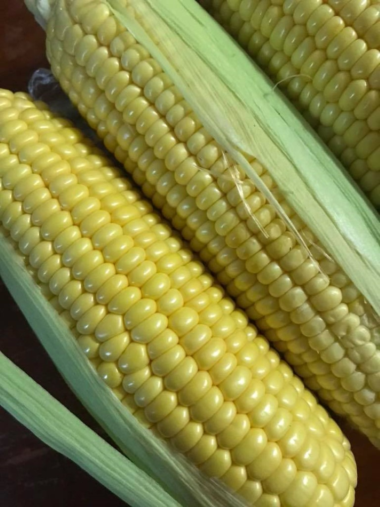

## Questions about maize

1. To when does maize retrace back in history of Nepal?
    - To the dawn of agriculture
2. How could have maize had found place in Nepalese lifestyle?
    - Settlers and travellers
3. What are the reasons behind popularity of Maize in Nepal?
    - Major stape diet
    - Rich in protein content
    - Convenient eat-as-you-go food
    - Makes excellent animal feed and fodder
4. Does maize have a substitute?
    - No
5. What will maize mean for Nepal?
    - A supporting cane in a long winding walk to food soverignity
6. Will maize rule?
    - Unfortunately no.

## Answers on maize

First off, It is necessary to be clear about what constitutes Maize. Gleaning from the fact that, most if not all, present day commercial varieties belong to _Zea_ genera, one might unwittingly gather a narrow sense for belongingness of Maize. Actually, Maize covers a whole deal of species of grass family placed under tribe Maydeae (pronounced "may-day" if one wishes to lay a bit more emphasis that maize definitely deserves). Diverse tribe maydae covers seven major identified genuses, one of which is the popular genus _Zea_. 

There is, however, a profound influence of geography as evident from the co-localization of certain genuses in similar locale as opposed to other. This inadvertently leads to the generalization that maize has discrete and multiple centre of origin. Historically, have been engaging debates alternately propping and criticizing certain postulates regarding the origin of modern Maize. [@anderson1942races] suggested Southwestern Asia as the centre of origin of Maize. Although, this hypothesis was shrugged off by several prominent researchers owing to materialistic evidence of ancient pollen remains having been recovered from the Mexico city[@bryant2007microscopic]. On one hand, neither the absence of substantiated evidence nor the apparent exhumation of a possibly different kind of material justifies the falsification of the hyphothesis concerning Asiatic center of origin. Secondly, focus has been laid on validating the outcome of hypothesized crosses through planned breeding activities.

A vast array of literature point towards South America as origin of _Zea_ and _Tripsacum_ genuses. The other five are generally agreed upon to have arisen in Asia. These genuses of distinct origin -- _Coix_, _Chiorachne_, _Polytoca_, _Sclerachne_ and _Trilobachne_ are more distantly related to modern day Maize than South American _Tripsacum_ genus. However, the intergeneric hybrid between _Zea_ and _Tripsacum_ still produce sterile individuals which persistently retain the male sterility even after several generations of backcrossing.

Maize farming has been one of the prime occupations of Hill people, besides livestock rearing. A defining feature of the hills is relatively young nature of the terrain. Rocks and constitutive layers are rapidly changing the states while the soil horizons near top, primarily the top-soil fraction, are exposed to a variety of weathering action. The topographical relief and the slope predispose the soil to the extremes of leaching and runoff phenomena. This all contributes to the dynamism of soil processes in the Hills. In the meantime, while the longstanding prevalence of maize by soundly adapting to this dynamic growth medium is appreciable, it's versatility to fend well also in impoverished soil and it's suitability of providing for muliple needs of a farming household makes Maize an excellent fit in hilly Nepal.

### Consumption

- More than two thirds of the maize produced in the midhills and highhills is used for direct human consumption at the farm level. 
- In the terai, less than 50% of the maize is used for human consumption and a significant part of the production goes to the market

### Cultivation

- Traditionally cultivated as rainfed crop in mixed cropping with millet(in _Bari_ land) in Nepal. 
- Often relayed with millet and upland crops.
- Owing to revelations about productivity of winter maize being greater, in recent years, trend of winter maize or even spring maize with supplemental irrigation is on rise.

### Yield

### Opportunities

- Tremendous opportunities exist for maize seed productivity enhancement, thereby narrowing down the wider yield gap mainly through horizontal/cultivation expansion in winter season.

- Although maize yields increased slightly (?? per annum), the present level (2.458 mt/ha) has not kept pace with the rapid growth of the population (?? per annum). 

- Maize demand is increasing at the rate of 11% per annum in Nepal. To fulfill the growing demand of milk, meat and meat productions, we are importing about 45% of maize to be used for feed from India. 

- While the import of food items is reduced, the only option we have is to increase the production through vertical and horizontal expansion of agricultural commodities.

- Its area in Terai can be expanded during winter to feed the people and livestock. Development of non-conventional hybrids for short-term and conventional hybrids for long-term is the best alternative to increase production and productivity of maize in Nepal (Gurung et al., 2011). 

- Furthermore, the special purpose maize like quality protein maize, sweet corn, baby corn and pop corn can also be grown in accessible areas to substitute the imports.	

### Factors enabling winter maize production

- Mid-western and far-western midhills are very well suited to winter maize cultivation mainly due to characteristic feature of winter precipitation in the region. 

- In mid-wester and far-western midhills, Since the production system follow maize-wheat or maize-millet cropping scheme, maintainance of crop stand for a longer growth duration might be yet basis for high yielding longer duration maize varieties/maize hybrids. 

Factors constraining winter maize production

- Scanty rainfall in eastern hills(Less than 200 mm winter rainfall occurs during entire months of November to March)

- Although a longer growth period in high-hills substantiates the possibility of maize production, the region is beleagured by the lack of connecting links that lead to market outlet.

### Maize agroecologies of Nepal

- The mid-hill (800-1800 masl)region running along the east-west belt of Nepal constitute 42% of the total geographical area.
- About 19% (??)of the total land area is cultivated whilst 28% (??) of all is arable in Nepal. 
- Terai avails 38% of the total land to culivation. Maize is, however, the third most important crop for the region.
- Only 15% of the total land in mid-hills is allocated to cultivation. Remarkably, maize is the foremost crop when it comes to providing for the food and nutrition requirements of the hill people, surpassing the paddy and wheat.
- For the high-hills, major emphasis is on livestock rearing and perennial crop based farming. Therefore, importance of maize in this region is characterized by intricate inter-relationship between cereal and livestock production.

### Interesting facts about maize

- Opaque-endosperm trait was first described by Guy Collins, which was later discoverd to be controlled by the waxy-endosperm (_wx1_) gene. The phenomena of linkage between the _wx1_ gene and the c1(colored aleurone 1) gene, also described in the same paper, is not, however, widely cited.

- Intrestingly, the maize type (waxy) was sent from China to US by a missionary, with a note mentioning it's possible use as porridge. The note, indeed, turned out to be sensibly recognized as valuable. The amylopectin starch portion could lead to use of maize in a way similar to rice and tapioca (for eg., in puddings).

- George Sprague and Merle Jenkins documented the breeding of productive hybrids with the waxy gene in the 1940s. Further research in waxiness and related traits paved the way to resolution of fine structure of a gene, first by Oliver Nelson.

### Commercial hybrid maize breeding program

Although for many breeding programs the avowed breeding goal is the improvement of grain yield, the course of program is sometimes dictated by the problems at hand. It may be necessary to address specific issues to ensure that primary goal remains undisputed. For example, occurance of drought during cetain years will highlight the importance of directing selection towards drought tolerace, anticipating similar situation over the coming years.

In the past, sporadic incidents in maize production plots have lead to redirect or add to the breeding objectives in the US maize breeding program include:

1. The onset of European corn borer (_Ostrinia nubilalis_ (Hubner)) in 1950s brought new needs for insect tolerance.
2. Farmer use of higher plant densities and increased rate of nitrogen fertilizer, starting in 1960s, increased needs for hybrids with stronger roots and stalks, and greater resistance to barrenness.
3. Plant density continues to increase to this day, even though nitrogen application amounts have leveled off. Constantly increasing plant density constantly increases needs for drought and shading tolerance, as well as for other kinds of stress tolerance.
4. In recent years no-till and minimum-till planting have increased the need for hubrids with tolerance to new diseases such as gray leaf spot (_Cercospora zeae-maydis_ Tehon & E.Y. Daniels).

In 1776 Koelreuter published his work on plant hybridization after noting an excessive luxuriance in his Nicotiana hybrids. A hundred years later Darwin (1877) described the hybrid vigor of plants in his book "The Effects of Cross and Self Fertilization in the Vegetable Kingdom." He stated:

		... the first and most important conclusion which may be drawn from the observations given in this volume, is that cross-fertilization is generally beneficial and self-fertilization injurious.
	
At almost the same time (1865) Mendel observed hybrid vigor in his pea hybrids. The term "heterosis" was first coined in a lecture at Gottingen, Germany by Shull in 1914. It referred to "the increased vigor, size, fruitfulness, speed of development, resistance to disease and to insect pests, or to climatic rigors of any kind, manifested by crossbred organisms as compared with corresponding inbreds, as the specific results of unlikeness in the constitutions of the uniting parental gametes" (Shull 1952; Zirkle 1952). Heterosis was first exploited in the 1930s with the large-scale production of hybrid corn, which provided an important impetus for other crops (Pingali et al. 1997). However, unlike in the easily emasculated maize, the inability to emasculate the seed parent had been the primary barrier for the utilization of heterosis in many cross-pollinated and self pollinated species. The onion research conducted by Jones and Clarke (1943) provided a solution to this problem. They identified male sterility in the onion cultivar 'Italian Red' (Jones and Emsweller 1936) in 1925, developed the CMS system for hybrid onion production, and revealed the genetic mechanism of eMS in onion (Janick 1989). The breeding strategy for hybrid onion was used by rice scientists in developing three-line hybrid rice.

-- adapted from "Long term selection in commercial hybrid maize breeding program"

### Management of hybrid seed production business

Among several topics of hybrid production, seed production management aspect has been detailed and the overview of production planning described in @macrobert2014maize. This invaluable publication, in an attempt to capacitate hybrid seed business stakeholdershe, lays emphasis on following aspects of hybrid maize seed production business:

1. Defining the product for the customer
- Gain creators
    - What are the critical performance quality traits needed in your product?
- Products and services
    - That will enable the customer achieve what they want to achieve
- Pain relievers
    - What are the basic quality traits needed to prevent dissatisfaction and reduce pain?
    - This deals with what problems you can eradicate and what the dissatisfaction are?

2. Problem statement and solution design process
- What is the problem to be solved? (Like, how do I produce more hybrid seeds in next 3 years?)
- Who are the decison makers?
- What are the criteria for success?
- What is the current reality or context?
- What are the solution opportunities?
- Who are the main stakeholders?
- What actions should be taken to implement?

2. Know your seed production chain
- What comes first and what comes next?
- Spend time researching about selecting good parental material, optimizing field management activities during production.
- Enhance general knowledge of maize botany, genetics and physiology.

3. Develop a sales pitch
- This covers several aspects including, having a good understanding of production process, quality and product assurance and, understanding and realization of production factors as well as their appraisal.
- The latter mostly relates with budgeting and planning.

4. Intervene in seed production chain
- After being fairly acquainted, personalized system should be developed to intervene in seed production process.
- This system should include recommendation system (intended for farmers) and record keeping system (intended for production/sales manager/personnel). An example recommendation system to farmers regarding specific hybrid seed production is given in @macrobert2014maize (page 10).

5. Knowing the production economics
- Work out the seed grower price models with estimates of profit margin, variable cost and total income.
- Choose the production pricing model wisely among Production cost model (Cost plus model), Market price model and Gross income model. Each model is described in detail in @macrobert2009seed.
